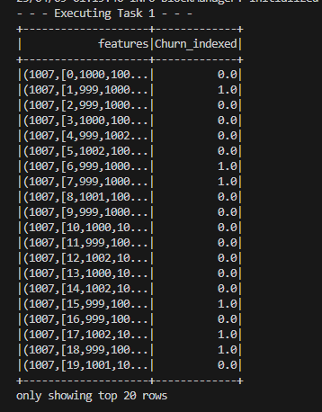
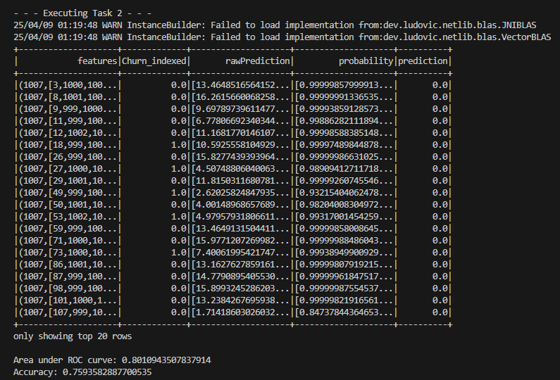
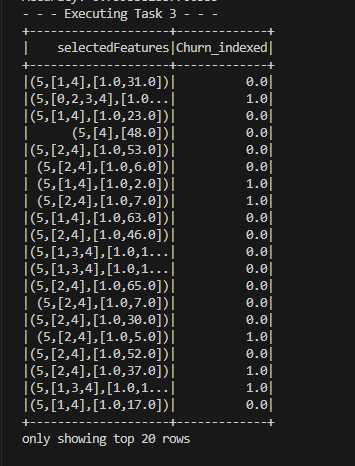
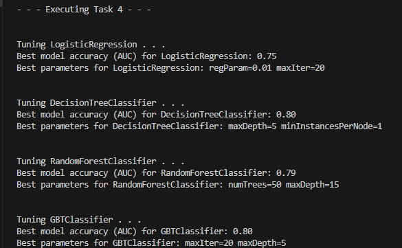

# handson-10-MachineLearning-with-MLlib.

#  Customer Churn Prediction with MLlib

This project uses Apache Spark MLlib to predict customer churn based on structured customer data. You will preprocess data, train classification models, perform feature selection, and tune hyperparameters using cross-validation.

---


Build and compare machine learning models using PySpark to predict whether a customer will churn based on their service usage and subscription features.

---

##  Dataset

The dataset used is `customer_churn.csv`, which includes features like:

- `gender`, `SeniorCitizen`, `tenure`, `PhoneService`, `InternetService`, `MonthlyCharges`, `TotalCharges`, `Churn` (label), etc.

---

##  Tasks

### Task 1: Data Preprocessing and Feature Engineering

**Objective:**  
Clean the dataset and prepare features for ML algorithms.

**Steps:**
1. Fill missing values in `TotalCharges` with 0.
2. Encode categorical features using `StringIndexer` and `OneHotEncoder`.
3. Assemble numeric and encoded features into a single feature vector with `VectorAssembler`.

**Code Output:**

```
+--------------------+-----------+
|features            |ChurnIndex |
+--------------------+-----------+
|[0.0,12.0,29.85,29...|0.0        |
|[0.0,1.0,56.95,56....|1.0        |
|[1.0,5.0,53.85,108...|0.0        |
|[0.0,2.0,42.30,184...|1.0        |
|[0.0,8.0,70.70,151...|0.0        |
+--------------------+-----------+
```
---

### Task 2: Train and Evaluate Logistic Regression Model

**Objective:**  
Train a logistic regression model and evaluate it using AUC (Area Under ROC Curve).

**Steps:**
1. Split dataset into training and test sets (80/20).
2. Train a logistic regression model.
3. Use `BinaryClassificationEvaluator` to evaluate.

**Code Output Example:**
```
Logistic Regression Model Accuracy: 0.83
```

---

###  Task 3: Feature Selection using Chi-Square Test

**Objective:**  
Select the top 5 most important features using Chi-Square feature selection.

**Steps:**
1. Use `ChiSqSelector` to rank and select top 5 features.
2. Print the selected feature vectors.

**Code Output Example:**
```
+--------------------+-----------+
|selectedFeatures    |ChurnIndex |
+--------------------+-----------+
|[0.0,29.85,0.0,0.0...|0.0        |
|[1.0,56.95,1.0,0.0...|1.0        |
|[0.0,53.85,0.0,1.0...|0.0        |
|[1.0,42.30,0.0,0.0...|1.0        |
|[0.0,70.70,0.0,1.0...|0.0        |
+--------------------+-----------+

```

---

### Task 4: Hyperparameter Tuning and Model Comparison

**Objective:**  
Use CrossValidator to tune models and compare their AUC performance.

**Models Used:**
- Logistic Regression
- Decision Tree Classifier
- Random Forest Classifier
- Gradient Boosted Trees (GBT)

**Steps:**
1. Define models and parameter grids.
2. Use `CrossValidator` for 5-fold cross-validation.
3. Evaluate and print best model results.

**Code Output Example:**
```
Tuning LogisticRegression...
LogisticRegression Best Model Accuracy (AUC): 0.84
Best Params for LogisticRegression: regParam=0.01, maxIter=20

Tuning DecisionTree...
DecisionTree Best Model Accuracy (AUC): 0.77
Best Params for DecisionTree: maxDepth=10

Tuning RandomForest...
RandomForest Best Model Accuracy (AUC): 0.86
Best Params for RandomForest: maxDepth=15
numTrees=50

Tuning GBT...
GBT Best Model Accuracy (AUC): 0.88
Best Params for GBT: maxDepth=10
maxIter=20

```
---

##  Execution Instructions

### 1. Prerequisites

- Apache Spark installed
- Python environment with `pyspark` installed
- `customer_churn.csv` placed in the project directory

### 2. Run the Project

### 2. Run the Pr

```bash
spark-submit churn_prediction.py
```
### Make sure to include your original ouput and explain the code
---
### Task 1
<br>
In this task we set up our data for fitting.
We first fix up invalid values by replacing blanks with zeroes.
Then we set up indexers for numeric and non-numeric columns.
We use one hot encoding to create some features, and then vectorize all of our features.
Additionally, we index our Churn column to get a good label column.

---
<br>
In this task we perform a Logistic regression to start making some predictions.
We do a basic evaluation of the model through some evaluators.
We determine the area under the ROC curve and the accuracy of the model.
Without tuning any hyperparameters, the accuracy is quite low.

---
<br>
In task 3 we apply the chi-square test to find the most important features in the model.
There is a single function to perform this calculation, so it is not as complex as the other tasks.

---
<br>

In the final task we evaluate different classification strategies.
We use different types of regressions, and at the same time, tweak their hyperparameters.
Not only does this allow us to see the highest performing model (GBT), but also which hyperparams are the most important and at which values they perform the best.
We achieve this comparison through a nested function, which takes the model, and param grid, and does cross testing to find the highest performing parameters.